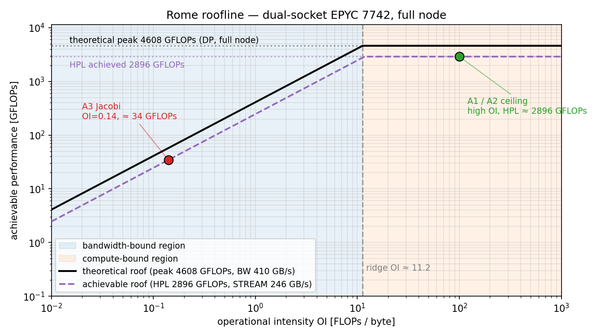
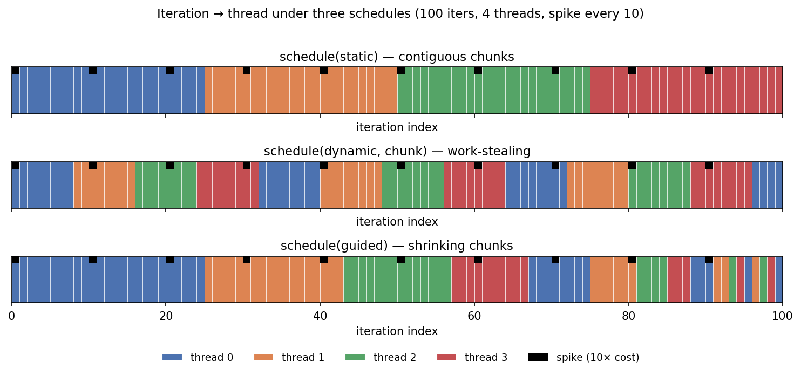

## Day 2 roadmap

**Morning** (09:00 – 12:00) — All lecturing, with short exercises.

1. Where day 1 left off + toolchain check
2. Introduce roofline model (we use this all week)
3. Performance-reporting
4. Data sharing & races
5. Reductions
6. Work sharing — `parallel for` + schedules
7. A1 lab brief

**Afternoon** (14:00 – 17:00) — A1 lab. No new material; instructor on hand.

End-of-day deliverable: A1 complete (correctness across `{1, 16, 64, 128}` threads + measurement table + REFLECTION + MCQ — multi-choice questions).

## Where day 1 left off

From [`ppp-hpc-intro`](https://github.com/ese-ada-lovelace-2025/ppp-hpc-intro), you can already:

- Log into `login.cx3.hpc.ic.ac.uk`
- `module load tools/prod GCC CMake`
- Write and submit a PBS job with resource directives
- Read `.o<jobid>` / `.e<jobid>` output
- Build and run `hello_world` with `#pragma omp parallel`
- Use `reduction`, `shared`, `private`, `default(none)`
- Set `OMP_NUM_THREADS`, `OMP_PLACES`, `OMP_PROC_BIND`

If any of these is shaky — flag now, before we build on it.

## What this course adds in days 2–4

**Day 2** — parallel regions + work-sharing in depth, schedule choice, A1 labs.

**Day 3** — synchronisation, memory model, **tasks + taskloop**, A2 labs.

**Day 4** — performance, NUMA, false sharing, **SIMD**, roofline, A3 labs.

**Day 5** — you iterate. All three assessments stay open; final snapshot at end of day 5.

## Toolchain check

### Development

I recommend you do most of your developmement on your laptop. Focus on correctness and performance improvement using cores available on laptop. When working on your assessment, GitHub actions will give you automated feedback when you push new commits to your repo.

#### macOS (laptop)
```bash
brew install libomp cmake
/opt/homebrew/opt/llvm/bin/clang --version
# → Homebrew clang version 22.x — defaults to OpenMP 5.1
```

#### Linux or WSL (Windows Subsystem for Linux)
```bash
sudo apt install clang libomp-16-dev cmake
```

### Benchmarking

#### CX3 Rome
```bash
module load tools/prod GCC CMake
```

## The `_OPENMP` macro

Every compliant OpenMP implementation `#define`s `_OPENMP` to a `YYYYMM` date.

| Macro value | Spec |
|---|---|
| `201511` | OpenMP 4.5 |
| `201811` | OpenMP 5.0 |
| **`202011`** | **OpenMP 5.1 — target for this course** |
| `202111` | OpenMP 5.2 |

Use it for portability shims, version assertions, and conditional compilation when you want a serial fallback.

## Example: detect OpenMP at compile time

```cpp
#ifdef _OPENMP
    static_assert(_OPENMP >= 202011, "Course requires OpenMP 5.1+");
    std::printf("OpenMP %d\n", _OPENMP);
#else
    #error "OpenMP support required for this course"
#endif
```

A compile-time guard you can paste at the top of any `.cpp` source file. The static-assert catches "wrong compiler module loaded"; the `#error` catches "compiled without `-fopenmp`".

## Querying the team — outside a region

```cpp
#include <cstdio>
#include <omp.h>

int main()
{
    std::printf("max threads: %d\n", omp_get_max_threads());
}
```

- `omp_get_max_threads()` — the *maximum* size for the **next** parallel region.
- Driven by `OMP_NUM_THREADS`, the schedule, runtime decisions, etc.
- Returns `1` if OpenMP is disabled.

## Querying the team — inside a region

```cpp
#pragma omp parallel
{
    if (omp_get_thread_num() == 0) {
        std::printf("team size:   %d\n", omp_get_num_threads());
    }
}
```

- `omp_get_num_threads()` — the *current* team size.
- `omp_get_thread_num()` — this thread's id in `[0, n)`.
- The `if (id == 0)` is the canonical "print once" idiom.

## Mental model: a parallel region

::: {.columns}
::: {.column width="25%"}

{width=100%}

:::
::: {.column width="75%"}

- `#pragma omp parallel` — fork a team of threads.
- Every thread runs the region body.
- `}` at the end of the region body is an implicit barrier — team joins.

:::
:::

::: {.callout-caution}
- Data defaults to `shared` *unless* a clause says otherwise.
- Recommend using `default(none)` clause to avoid accidently sharing variables.
:::

## Introduction to roofline model {visibility="uncounted"}

The **roofline model** assumes kernel performance are limited by one of two ceilings:

- Compute — how many FLOPs per second your hardware can execute.
- Memory bandwidth — how many bytes per second your hardware can move.

::: {.callout-note}
We'll revisit the roofline model in more detail on day 4 - quick intro now so you can start using it from the start in your assessments.
:::

::: {.callout-tip}
## Deep dive: Roofline
* Williams, Waterman & Patterson, *"Roofline: an insightful visual performance model for multicore architectures"*, CACM 2009, [https://people.eecs.berkeley.edu/~kubitron/cs252/handouts/papers/RooflineVyNoYellow.pdf](https://people.eecs.berkeley.edu/~kubitron/cs252/handouts/papers/RooflineVyNoYellow.pdf).
:::

## Operational intensity

$$OI = \frac{\text{FLOPs performed}}{\text{bytes moved to/from main memory}}$$

The ceiling is:

$$\text{ceiling} = \min(\text{peak FLOPs},\; OI \times \text{STREAM bandwidth})$$

- **High OI** (lots of compute per byte) → compute-bound → aim for peak FLOPs.
- **Low OI** (little compute per byte) → bandwidth-bound → aim for STREAM.

The **ridge** OI separates the two regimes: `ridge_OI = peak / BW`. On Rome the ridge sits at ≈ 18.7 FLOPs/byte.

::: {.callout-tip}
## Deep dive: STREAM
* [McCalpin, J. D. (1995). Memory Bandwidth and Machine Balance in Current High Performance Computers. IEEE Computer Society Technical Committee on Computer Architecture (TCCA) Newsletter, December 1995.](https://www.researchgate.net/profile/John-Mccalpin/publication/51992086_Memory_bandwidth_and_machine_balance_in_high_performance_computers/links/5858166208aeffd7c4fbb1aa/Memory-bandwidth-and-machine-balance-in-high-performance-computers.pdf)
* [STREAM](https://www.cs.virginia.edu/stream/) website and software. 
:::

## Roofline plot on AMD EPYC 7742

{width=85%}

Our measured roofline CX3 (STREAM Triad and OpenBLAS HPL run) reach about
60-63% of the theoretical DDR4 and AVX2 peaks. Other EPYC 7742 systems report
higher or lower roofs depending on tuning, NUMA placement, compiler, and BLAS.

## Computing OI for a kernel — Jacobi

::: {.columns}
::: {.column width="50%"}

A 7-point 3D Jacobi update at one grid point:

```cpp
u_next[i,j,k] = (u[i,j,k] + u[i±1,j,k] +
                 u[i,j±1,k] + u[i,j,k±1]) *
                 (1/7);
```

:::
::: {.column width="50%"}

- **Reads**: 7 doubles × 8 B = **56 B**.
- **Writes**: 1 double × 8 B = **8 B**.
- **FLOPs**: 6 adds + 1 multiply = **7 FLOPs**.

:::
:::

$$OI_{\text{Jacobi}} = \frac{7}{56 + 8} = \frac{7}{64} \approx 0.11\;\text{FLOPs/byte}$$

::: {.callout-note}
## A limitation of the roofline model
The OI you measure on hardware is rarely the OI you read off the source. Cache reuse, fused multiply-add, vector intrinsics, and compiler optimisations all shift it. Roofline assumes a flat, average byte cost per kernel — it does not model cache reuse, prefetching, or NUMA placement. Two kernels with the same source-level OI can land at very different points on the roofline once the memory hierarchy is involved. Treat the model as a first-order ceiling, not a prediction.
:::

## Shared memory: UMA vs NUMA

Locality matters

- **UMA (Uniform Memory Access)**:
  * Every core sees the same memory at the same latency.
- **NUMA (Non-Uniform Memory Access)**:
  * Memory is partitioned across *nodes*.
  * Cores access local memory with low latency.

## AMD EPYC 7742 dual-socket (Rome) {visibility="uncounted"}

Rome has 8 NUMA domains; cross-socket traffic is ~3× the latency of local main memory.

{width=70%}

## Rome - continued {visibility="uncounted"}

| Quantity | Value |
|---|---|
| Sockets | 2 |
| Physical cores per node | 128 |
| Hyperthreading (SMT) | off — 128 threads = 128 physical cores |
| NUMA domains per node | 8 (4 per socket, 16 cores per domain) |
| Cores per NUMA domain | 16 |

The canonical thread ladder `{1, 16, 64, 128}` maps directly to this geometry: serial / one NUMA domain / one socket / full node.

## Rome - continued {visibility="uncounted"}

| Quantity | Value |
|---|---|
| Peak double-precision GFLOPs (full node, theoretical) | **4608** (128 cores × 2.25 GHz × 16 floating-point operations per cycle from the AVX2 vector unit) |
| HPL DP throughput (measured) | **2896 GFLOPs** ≈ 63 % of theoretical (foss/2024a + OpenBLAS) |
| STREAM triad ceiling — 32 threads, one per CCX | **246.2 GB/s** |
| STREAM triad @ 128 threads (full node, close+cores) | 231.5 GB/s |
| Ridge OI | 4608 / 246 ≈ **18.7 FLOPs/byte** |

- **A1 + A2** are compute-bound in principle; scored on **reference-parallel-time ratio** at 128 threads vs the published `T_ref`.
- **A3-core** is bandwidth-bound (OI ≈ 0.14); scored on **roofline fraction** vs measured STREAM (graduated 0.70 / 0.50 / 0.30 / 0.15).

## Reporting — three different metrics

When you talk about "this code is fast", *which* metric do you mean?

| Metric | Formula | What it tells you |
|---|---|---|
| Time-to-solution | $T(P)$ | How long does the user wait? |
| Speedup | $T(1) / T(P)$ | How much faster did *I* get this code? |
| Reference-parallel-time ratio | $T_{\text{ref}}(P) / T(P)$ | How does *my* code compare to a reference? |
| Roofline fraction | $\text{achieved} / \text{ceiling}$ | How close to the hardware ceiling am I? |

## Speedup

Each answers a different question. **Speedup** is the headline number people quote, but it can be **misleading** if your serial baseline is slow — a poorly-vectorised, badly-laid-out serial baseline makes any parallel implementation look heroic.

::: {.callout-tip}
## Deep dive: Twelve Ways to Fool the Masses When Giving Performance Results on Parallel Computers
* [https://www.davidhbailey.com/dhbpapers/twelve-ways.pdf](https://www.davidhbailey.com/dhbpapers/twelve-ways.pdf) -- The "ways" are written as advice for fooling reviewers — read them inverted as a checklist of pitfalls to avoid in your own A1 / A2 / A3 reporting. Reference-parallel-time scoring (which we use) is specifically designed to close several of these.
:::

## The bad-serial-that-scales-well trap

Imagine two students:

| Student | $T(1)$ | $T(128)$ | Self-speedup | Time-to-solution |
|---|---|---|---|---|
| A | 100 s | 1.0 s | **100×** ✨ | 1.0 s |
| B | 8 s | 0.8 s | 10× | 0.8 s |

Student A's "100× speedup" looks impressive and is technically correct. But student B's program is **faster in the wall clock**.

Why **reference-parallel-time** is the more informative comparison: it normalises out the quality of the serial baseline. A slow serial just gives you slow parallel.

## Data race

A race is two threads accessing the same memory location, at least one writing, with no intervening synchronisation. The standard says the program's behaviour is **undefined** — anything can happen.

In practice on x86 / arm64 you'll see:

- **Lost updates:** `++counter` from many threads → final value < expected.
- **Torn reads:** one thread reads half-updated bytes from another's write.
- **Reordered observations:** thread B sees `ready=1` *before* it sees the data the producer published.

We'll expose all three on this course. `default(none)` plus `reduction` / `atomic` / `flush` are the toolset.

## Parallel regions — the fundamentals



## Parallel regions (cont.)

- Fork at `#pragma omp parallel`, join at the closing brace.
- `omp_get_thread_num()` / `omp_get_num_threads()` are queries inside the team.
- `#pragma omp single` runs once on whichever thread reaches it first; implicit barrier at exit.
- `default(none)` forces every captured variable to be enumerated — the compiler catches accidental sharing.

## Data-sharing clauses

| Clause | Meaning |
|---|---|
| `shared(x)` | one copy, all threads see it |
| `private(x)` | per-thread uninitialised copy |
| `firstprivate(x)` | per-thread copy, initialised from outer value |
| `lastprivate(x)` | per-thread copy; outer value updated from the *last* iteration |
| `default(none)` | compiler errors unless every referenced variable is enumerated |
| `default(shared)` | implicit; the foot-gun this course rejects |

## `shared` / `private` / `firstprivate` — worked example

```cpp
int outer = 42;
int total = 0;

#pragma omp parallel default(none) shared(total) firstprivate(outer)
{
    // outer:  per-thread copy, initialised to 42 (modifiable)
    // total:  shared; updates need synchronisation
    outer += omp_get_thread_num();   // safe — local
#pragma omp atomic
    total += outer;                  // synchronised — global
}
// outer is still 42 here in the master thread.
```

## The `default(none)` discipline

Strongly recommend that every parallel region in this course uses `default(none)`.

- Captured variables defaulting to `shared` is the #1 souce of data race conditions.
- `default(none)` forces you to write *what you intend* — explicitly.
- Reading a parallel region with `default(none)` is auditable: every variable's role is declared on the line.

```cpp
#pragma omp parallel default(none) shared(a, n) reduction(+:sum)
```

## What goes wrong without `default(none)`



- `count_races` looks innocent; `counter` defaults to `shared`.
- Every thread does an unsynchronised read-modify-write.

## Try it — a standalone TSan demo {visibility="uncounted"}

Save this as `race_demo.cpp`:



## Try it — compile, run, read the report {visibility="uncounted"}

Compile with TSan, then run:

```bash
clang++ -fopenmp -fsanitize=thread -g -O1 race_demo.cpp -o race_demo
./race_demo
```

Expected output (one of several `WARNING` blocks, then the result):

```
==================
WARNING: ThreadSanitizer: data race (pid=...)
  Write of size 4 at 0x... by thread T3:
    #0 main.omp_outlined race_demo.cpp:19
  Previous write of size 4 at 0x... by main thread:
    #0 main.omp_outlined race_demo.cpp:19
SUMMARY: ThreadSanitizer: data race race_demo.cpp:19 in main.omp_outlined
==================
counter = 86342 (expected 100000)
```

Two pieces of evidence the race is real: TSan reports it, and the printed `counter` is less than 100000 (lost updates from interleaved increments).

## Fix — `default(none)` plus `reduction`



- `default(none)` makes the compiler force you to enumerate every variable.
- `reduction(+ : counter)` declares a per-thread private copy combined at region exit.

## When `firstprivate` is right



- `firstprivate` is right when each thread genuinely *mutates* a per-iter scratch initialised from an outer value.
- The clause makes that intent explicit: "every thread starts here, then diverges."

## When `firstprivate` is wrong



- For *read-only* outer values, `shared` says exactly that and is clearer.
- **Reader confusion**: a future reader has to work out *why* each thread needed its own copy. If the answer is "the variable is read-only and never mutated," the clause is misdirection.
- **Race masking**: a `firstprivate` variable that should have been `shared` looks correct — each thread has its own copy — even when an intended-shared write was the actual bug. TSan won't flag a race that isn't in the runtime trace.

## Reductions — idiom



- Per-thread private copy of `sum`, combined at region exit. No atomic needed.
- The reduction operator `+` is the *first* token; the variable is right of `:`.
- Floating-point arithmetic is not associative - changing the order may change result due to roundoff.

::: {.callout-tip title="Deep dive: What every computer scientist should know about floating-point arithmetic"}
* [https://dl.acm.org/doi/10.1145/103162.103163](https://dl.acm.org/doi/10.1145/103162.103163)
:::

## Built-in reduction operators

| Operator | Identity |
|---|---|
| `+` | 0 |
| `*` | 1 |
| `-` | 0 |
| `&` | all-bits-set |
| `|` | 0 |
| `^` | 0 |
| `&&` | 1 |
| `||` | 0 |
| `min` | type-max |
| `max` | type-min |

The compiler initialises each thread's private copy to the identity automatically.

## User-defined reductions

- Built-in `reduction(+:x)` works on scalars. Reducing **compound state** (here: count + sum + sum-of-squares so we get mean and variance in one pass) needs `declare reduction`.
- Syntax: `declare reduction(<name> : <type> : <combiner>) initializer(...)`. The combiner uses two magic names — `omp_out` (the running accumulator) and `omp_in` (an incoming partial) — and must be associative + commutative.
- After the loop: `mean = s.sum / s.n` and `var = s.sum_sq / s.n − mean²` — one parallel pass, two statistics.
- If you find yourself wrapping a compound update inside `#pragma omp critical`, you almost always wanted a user-defined reduction.

## User-defined reductions



## Reduction race traps

A common bug — reaching for `critical` when you meant `reduction`:

```cpp
double sum = 0.0;
#pragma omp parallel for default(none) shared(sum, a, n)   // ← sum is shared!
for (size_t i = 0; i < n; ++i) {
#pragma omp critical
    sum += a[i];                  // serialises every iter; ~p× slower than serial
}
```

The race is hidden under the `critical` (correct), but performance is worse than serial (every thread waits for the lock). The fix is `reduction(+ : sum)` and dropping the `critical` entirely.

## Work-sharing: `parallel for`

`#pragma omp parallel for` is the most important worksharing construct. It opens a parallel region *and* distributes loop iterations across the team in one directive.

```cpp
#pragma omp parallel for default(none) shared(a, n) reduction(+:sum)
for (std::size_t i = 0; i < n; ++i) {
    sum += a[i];
}
```

What the compiler does:

1. Creates a team (size from `OMP_NUM_THREADS` / `omp_get_max_threads()`).
2. Distributes `[0, n)` across the team according to the schedule.
3. Each thread gets a private `sum` initialised to the reduction identity.
4. Combines per-thread privates at the implicit barrier.

## `parallel for` — loop restrictions

Not every C++ loop can be parallelised. The OpenMP "canonical loop form" requires:

- A single integer counter incremented by a constant per iteration.
- Loop bounds known at loop entry (no run-time mutation).
- **No `break`, `return`, `goto` exiting the loop.**
- **No mutation of the loop variable inside the body.**
- The body must not depend on iteration order (no recurrence `a[i] = a[i-1] + ...`).

Iterators-of-random-access containers (`std::vector::iterator`) are allowed since OpenMP 5.0; bidirectional/forward iterators (e.g. `std::list<int>`) are not.

* OpenMP needs to compute the iteration count and split the range across threads. Random-access iterators support `it_end - it_begin` and `it + i` in O(1); bidirectional and forward iterators don't, so the compiler can't generate the worksharing code.

## `nowait` — when it's safe

```cpp
#pragma omp parallel default(none) shared(a, b, n)
{
#pragma omp for nowait
    for (size_t i = 0; i < n; ++i) a[i] = 1.0;
    // no implicit barrier — fast threads continue immediately

#pragma omp for
    for (size_t j = 0; j < n; ++j) b[j] = 2.0;
}
```

`nowait` strips the implicit barrier from a worksharing construct. **Only safe when the next stage has no dependence on the previous one.** If the second loop read `a[i]`, this would race.

## `parallel for` schedule kinds

| Schedule | When to use |
|---|---|
| `static` | Uniform per-iteration cost |
| `static, C` | Blocks of size C; round robin; good for load balancing; poor for NUMA-sensitive layouts |
| `dynamic, C` | Highly irregular cost |
| `guided` | Cost decreases toward loop end |
| `auto` | Let the runtime decide (rarely what you want) |
| `runtime` | Read `OMP_SCHEDULE` env var |

* **C** is chunk size.
* For A1, **measure** two or three; pick by timing.

## Schedule — three variants of the same kernel



`static` distributes iterations contiguously across threads. One thread inherits all the spike iterations.

## Schedule — `dynamic, 64`



`dynamic, 64` hands out 64-iteration chunks on demand. Spike iterations spread across threads — load is balanced.

## Schedule — `guided`



`guided` shrinks chunks as the loop progresses — trades scheduling overhead for tail balance. Often a sensible default when you don't want to think hard.

## Iteration → thread under each schedule

{width=90%}

- Black notches mark spike iterations (~10× cost).
- `static`: spikes clustered on each thread's chunk.
- `dynamic, chunk`: spikes evenly distributed by work-stealing.
- `guided`: contiguous early, finer toward the tail.

## Default schedule is implementation-defined

> The schedule chosen if no `schedule` clause appears (or if `schedule(runtime)` and `OMP_SCHEDULE` is unset) is *implementation-defined* — OpenMP 5.1, §2.10.4.

In practice GCC and Clang default to `static` with even chunks — but this is **not portable**. If your A1 happens to work without a `schedule` clause, that's an accident, not a guarantee.

**Always specify a schedule explicitly** when iteration cost is non-uniform.

## Chunk size tuning

`schedule(dynamic, C)` — the chunk size `C` is a tuning parameter:

| Chunk too small (C = 1) | Chunk too big (C = N/p) |
|---|---|
| Scheduling overhead per chunk dominates | Same as `static` — load imbalance returns |
| Cache lines bounce between threads | One thread inherits a cluster of spikes |

For a spike-every-10 workload, `C = 64` is a reasonable starting point: ~10 spikes per chunk, amortising the dispatch overhead.

## Schedule-sweep methodology

The right way to pick a schedule for an unfamiliar workload:

```cpp
// Measure each schedule once; pick the minimum.
const double t_static  = time_schedule_static(n, &sum);
const double t_dynamic = time_schedule_dynamic(n, &sum, /*chunk=*/64);
const double t_guided  = time_schedule_guided(n, &sum);

// Pick the winner; record all three in tables.csv for the REFLECTION.
```

For A1: do this at each thread count `{1, 16, 64, 128}`. Don't assume the same winner at every count — schedule overhead vs load-balance trade-off shifts with team size.

## Timing the parallel region — `omp_get_wtime`

```cpp
const double t0 = omp_get_wtime();
#pragma omp parallel for ...
for (...) { ... }
const double t1 = omp_get_wtime();
const double duration_s = t1 - t0;
```

- Single read on entry, single read on exit — *outside* the parallel region.
- First parallel region pays a one-time runtime startup; **warm up** with a small region first if measuring the second one.
- Wall-clock time, in seconds. Returns relative to an implementation-defined origin.

## Environment variables that matter for A1

| Var | Effect |
|---|---|
| `OMP_NUM_THREADS=128` | Sets the maximum team size. |
| `OMP_PROC_BIND=close` | Pin threads to nearby cores; first-touch matters for A3. |
| `OMP_PLACES=cores` | Pin to physical cores (one thread per core). |
| `OMP_SCHEDULE=guided` | Default for any `schedule(runtime)` clause. |
| `OMP_DISPLAY_ENV=true` | Print all OpenMP env at program start — useful for sanity checking. |

For A1 on Rome you'll see `OMP_NUM_THREADS=128 OMP_PROC_BIND=close OMP_PLACES=cores` set automatically by the PBS script.

## Pragma typos silently compile

```cpp
#pragma opm parallel       // typo — silently ignored, code runs serial
{ ... }
```

The compiler treats unknown pragmas as no-ops. Your program builds, runs, and gives the right answer — just at single-thread speed. Symptoms: mysteriously linear speedup curve (not even close to ideal), no TSan races.

**Check your build output for `unrecognized #pragma`** — Clang emits a warning under `-Wall`. This course's `.clang-tidy` enforces it.

## Tips & gotchas (consolidated)

- Always use `default(none)` in taught code.
- Specify a `schedule` explicitly when cost is non-uniform.
- Conditional compile with `_OPENMP` if you need a serial fallback.
- Time with `omp_get_wtime`, not `std::clock` (latter sums across threads).
- When in doubt, reach for `reduction`, not `critical` or `atomic`.
- Read CI output: TSan + Archer catch races deterministically.

## A1 brief — what you'll be doing

**Kernel**: composite-trapezoid integration of `f(x)` over `[0, 1]` with N subintervals. `f(x)` has a deliberate **spike region** between `x ∈ [0.3, 0.4]` running ~10× slower than elsewhere — schedule choice is genuinely informative.

**Skills exercised**: `parallel for` + `reduction(+:sum)` + schedule choice.

**Scoring** (20 pts):

- Build + TSan clean (2)
- Correctness graduated (6) at `{1, 16, 64, 128}`
- **Reference-parallel-time perf** (5) at 128 threads vs published `T_ref`
- `tables.csv` internal consistency (1)
- Style + MCQ + REFLECTION format + reasoning question (6)

## A1 deliverables checklist

| Path | What |
|---|---|
| `assignment-1/integrate.cpp` | your parallel implementation |
| `assignment-1/answers.csv` | 15 MCQ answers (one A/B/C/D per row) |
| `assignment-1/tables.csv` | times + speedups + efficiencies at 4 thread counts |
| `assignment-1/REFLECTION.md` | required headers, ≥ 50 words per section |
| `assignment-1/perf-results-a1.json` | hyperfine output from your CX3 self-bench |

CI lights up green when the code builds + passes TSan + your answers/tables/REFLECTION are well-formed. The afternoon-lab brief lists the order to attack these in.

## `tables.csv` — internal consistency

The grader checks each row of your `tables.csv` for two arithmetic identities:

$$\text{speedup} = \frac{T(1)}{T(P)}, \qquad \text{efficiency} = \frac{\text{speedup}}{P}$$

Within 2 %. So if you put `T(1)=10`, `T(64)=0.5`, `speedup=20`, `efficiency=0.4`, the grader checks:

- `speedup ≈ 10 / 0.5 = 20` ✓
- `efficiency ≈ 20 / 64 = 0.3125` ✗ (you put 0.4)

**Internal-consistency only** — your own measurements vs your own derived columns. No cross-check against the instructor's re-run; variance between HPC runs is real and not held against you.

## Afternoon — A1 lab {visibility="uncounted"}

The afternoon (14:00 – 17:00) is yours. Instructor on hand for code review, questions, and unsticking. No new material.

- Open `assignment-1/` in your fork; build locally.
- Edit `integrate.cpp`. Schedule sweep on Rome at `{1, 16, 64, 128}`.
- Fill in `tables.csv` (the grader checks `speedup = T(1)/T(P)` and `efficiency = speedup/P`).
- Answer the 15 MCQ in `answers.csv`.
- Fill in `REFLECTION.md` (≥ 50 words per section; format check only).
- Push and watch formative CI light up.

A1 is scored on **reference-parallel-time ratio** at 128 threads against the published `T_ref`. Final submission deadline is end of day 5; today's submit is encouraged but not the deadline.
