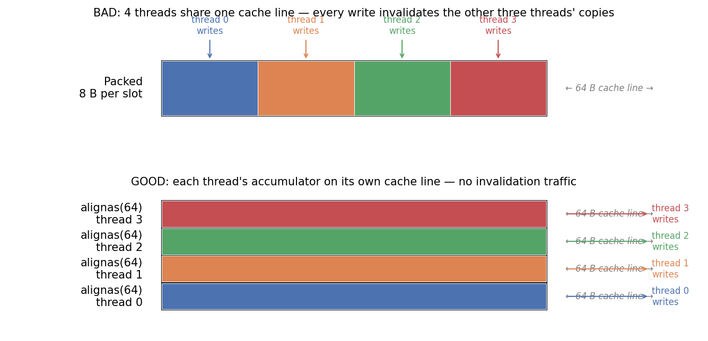
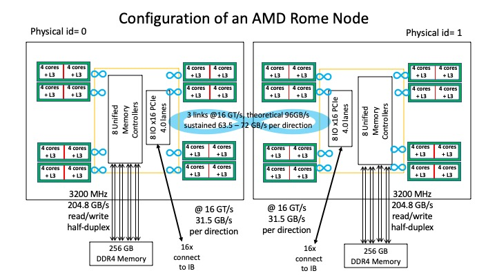
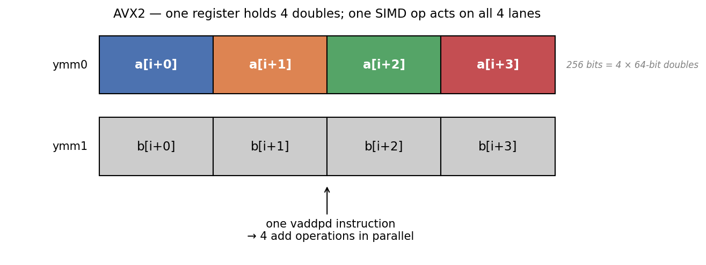

## Day 4 roadmap

**Morning** (09:00 – 12:00) — All lecturing, with short exercises.

1. A2 retrospective
2. The performance mindset — six sources of overhead
3. Timing the parallel region
4. Roofline revisited
5. Cache coherency + false sharing
6. NUMA on Rome
7. Loop transformations + SIMD
8. A3 lab brief

**Afternoon** (14:00 – 17:00) — A3 lab. No new material; instructor on hand.

End-of-day deliverable: A3-core + chosen A3-extension complete.

## A2 retrospective {visibility="uncounted"}

Yesterday you wrote two Mandelbrot variants and benchmarked both.

- **Which variant did your data say was faster?** Show of hands.
- **What `grainsize` (or chunk size) did you settle on?** What was your search procedure?
- **Did your CHOICE.md reasoning match your numbers?** If yes, perfect. If no, what made you doubt the data?

Reminder: A2's image region is *not* tuned for tasks-always-wins. Either variant can be the right answer — the grader scores against your own measurements.

## The six sources of parallel-region overhead

Whatever your kernel, you are paying *at least* these six costs by going parallel:

1. **Sequential code** — Amdahl's law caps your speedup.
2. **Idle threads / load imbalance** — fastest threads waiting for slowest.
3. **Synchronisation** — barriers, locks, atomics, cache-coherence traffic.
4. **Scheduling** — chunk dispatch, dynamic-queue contention.
5. **Communication** — cache-line traffic between cores.
6. **Hardware contention** — memory bandwidth, cache space, hyperthreading (SMT), oversubscription.

Today: the last three. Tomorrow's diagnostic decision-tree leans on this list.

## Sequential code (Amdahl)

```cpp
serial_setup();          // 5 % of total
parallel_compute();      // 95 % of total
```

If 5 % of your wall-clock can't be parallelised, the *theoretical* best speedup is:

$$S_{\max} = \frac{1}{0.05 + 0.95/P} \quad\xrightarrow{P\to\infty}\quad 20\times$$

That's the cap, regardless of how many threads you throw at it. The way out is to attack the serial fraction first.

## Idle threads and load imbalance

```
thread 0: ████████████ working ████████████████  done
thread 1: ████████ working ████████ DONE — idle until barrier...
thread 2: ████████████████████ working ███████████ done
thread 3: ██████ working ██  DONE — idle ...
                                                     ↑
                                              everyone waits here
```

- The implicit barrier at the end of `for` waits for the slowest thread.
- Variance in per-iter cost = idle threads at the tail.
- `schedule(dynamic, C)` and `taskloop grainsize(C)` are the standard counter-measures. A1 + A2 both exercised this.

## Synchronisation overhead

Anything that orders thread interleavings costs cycles:

- A `barrier` flushes write buffers and blocks until all threads arrive.
- A `critical` serialises through one global mutex.
- An `atomic` issues a `lock`-prefixed instruction (on x86) or a load-linked / store-conditional pair (on arm64).
- `omp_set_lock` round-trips through the kernel on contention.

Rule of thumb: minimise synchronisation by *design* (use `reduction`; partition data; one lock per data instance), not by *micro-optimising* each barrier.

## Communication / coherence traffic

Cache lines are the unit of CPU-to-CPU communication. When two cores write the same line, the line bounces between their caches — even if the two cores are writing different *bytes*. We'll cover the details (false sharing) shortly.

The cost is real: a cache-line bounce on Rome costs ~100 ns; doing this 10⁶ times per loop iteration sinks performance dramatically.

## Timing the parallel region — `omp_get_wtime`

The canonical idiom: one read before, one read after, *outside* the parallel region.



- Single read on entry, single read on exit. Don't take per-thread timestamps.
- Wall-clock includes scheduling, contention, NUMA traffic — usually exactly what you want for a perf measurement.
- `omp_get_wtime` returns wall-clock seconds since an implementation-defined origin; only differences are meaningful.

## Timing — adding a warm-up region

The first measurement of any kernel pays a stack of one-time costs the second one doesn't. Wrap the timed region with a *warm-up* that mirrors the real access pattern, then throw away its wall-clock:



- **NUMA first-touch placement**: physical pages are allocated on the NUMA node of whichever thread first writes to them. Without a parallel warm-up, pages may sit on the main thread's node — remote-node access is 1.5–3× slower on Rome.
- **Page faults**: ~10 µs per 4 KB page; a 100 MB array costs ~0.5 s.
- **CPU frequency / Turbo settling**: cores ramp clock from idle. Short kernels measured cold land below steady-state.
- **TLB / cache warming**: marginal for streaming kernels (each iteration evicts the last).
- **OpenMP team creation**: tens of µs to spin up the worker threads.

## Roofline — proper treatment {visibility="uncounted"}

We previewed this on day 2. Now the full picture.

| Kernel | OI (FLOPs/byte) | Regime | Ceiling |
|---|---|---|---|
| A1 integration | >> 10 | Compute-bound | Peak FLOPs |
| A2 Mandelbrot | >> 10 | Compute-bound | Peak FLOPs |
| A3 Jacobi | ~0.14 | Memory-bound | OI × STREAM |

## Compute-bound regime

For high-OI kernels (A1, A2):

- Bottleneck: the FPU's instruction throughput.
- Adding cache won't help — data is already cheap to access.
- Adding bandwidth won't help — the FPU is the constraint.
- **What does help**: SIMD, instruction-level parallelism, better algorithms with more reuse.

Target on Rome: theoretical peak DP **4608 GFLOPs** node-wide (128 cores × 2.25 GHz × 16 FLOPs/cycle AVX2 FMA). That number is hardware-derived, not measured — almost no real workload reaches it. We need a benchmark to tell us what *is* reachable.

## HPL — what it measures

**HPL** (High-Performance Linpack, [http://icl.utk.edu/hpl/](http://icl.utk.edu/hpl/)) is the compute-bound counterpart to STREAM, and the benchmark behind the **Top500** supercomputer ranking.

What it does:

- Generates a random dense `N × N` matrix `A` and right-hand side `b`.
- Solves `A x = b` by **LU factorisation with partial pivoting**, then verifies the residual.
- Reports `Gflops = (2/3 N³ + 2 N²) / time` — i.e. the throughput of the underlying DGEMM kernel.

## HPL — why it's the "achievable peak"

- ≈ 90 % of FLOPs land in DGEMM (the rank-`k` updates inside the LU). DGEMM is the most-tuned kernel in numerical computing.
- DGEMM has very high operational intensity (`O(N)` FLOPs per byte), so the FPU — not the memory subsystem — sets the ceiling.
- The remaining 10 % (panel factorisation, pivot exchange, communication) is what makes HPL hard to push past ~75 % of theoretical. Vendor BLAS libraries publish HPL numbers as the headline.

A useful rule of thumb: **theoretical peak** is what physics allows, **HPL** is what vendor BLAS achieves, **your code** lives somewhere lower.

::: {.callout-tip}
## Deep dive: Top500

[https://top500.org/](https://top500.org/) — biannual ranking (ISC in June, SC in November) of the world's largest supercomputers since 1993.

- Ranked by **Rmax** (HPL achieved); efficiency `Rmax/Rpeak` typically 65–85 % — same ratio as our 63 % on Rome.
- Exascale era: leaders (Frontier, Aurora, El Capitan) at ≥1 EFLOPs ≈ 10⁶ × one Rome node.
- Sister lists: **HPCG** (memory-bound; reorders the ranking) and **Green500** (FLOPs/W).
:::

## HPL on Rome — what we measured

Run on `cx3-4-13`, 2026-04-26 — `docs/rome-hpl.pbs`:

| Parameter | Value |
|---|---|
| Binary | EasyBuild HPL/2.3-foss-2024a (Icelake build; runs on Zen 2 via AVX2) |
| BLAS | OpenBLAS 0.3.27 (Icelake-tuned, not Zen-tuned) |
| Layout | 8 MPI ranks × 16 OpenMP threads = 128 cores; one rank per NUMA domain |
| Process grid | P × Q = 2 × 4 |
| Problem size | N = 80 000 (≈ 51 GB matrix); NB = 232 |
| Wall time | 117.88 s |
| Residual | PASSED (≈ 1.7e-3, well under threshold 16) |
| **Achieved DP** | **2896 GFLOPs** ≈ **63 %** of theoretical 4608 |

: {tbl-colwidths="[20,80]"}

The 12 percentage-point gap to AMD's published ~75 % is the BLAS choice — AOCL-BLIS is Zen-tuned and would close most of it.

::: {.callout-tip}
## What this means for A1 / A2
A1 and A2 are *compute-bound in principle* but are not DGEMM. They have spike regions, branchy iterations, and limited reuse — they reach a few percent of HPL, not a respectable fraction of it. The reference-parallel-time metric is what we actually grade with. HPL is the upper bound a hand-tuned BLAS-style implementation would achieve, **not** a target.
:::

## Bandwidth-bound regime

For low-OI kernels (A3 Jacobi, STREAM):

- Bottleneck: how fast the memory subsystem can deliver bytes.
- Adding compute won't help — the FPU is starving.
- Adding cache *can* help if reuse exists.
- **What does help**: blocking / tiling for cache, NUMA placement, prefetching, *fewer* bytes per FLOP.

Target on Rome: STREAM triad ceiling **246.2 GB/s** (32 threads, one per CCX); at 128 threads full-node we measure 231.5 GB/s due to L3 contention. A3 ceiling at the hardware peak ≈ 0.14 × 246 ≈ **34 GFLOPs**; A3 at 128 threads tops out near 0.14 × 231 ≈ 32 GFLOPs.

## STREAM bandwidth — which kernel?

STREAM measures four kernels. They probe the memory subsystem differently and give different headline numbers — which one belongs in the roofline?

| Kernel | Per-element pattern | FLOPs | Rome cx3 GB/s @ 32T |
|---|---|---|---:|
| `Copy`  | `c[i] = a[i]`               | 0 | **337** |
| `Scale` | `b[i] = q*c[i]`             | 1 | 224 |
| `Add`   | `c[i] = a[i] + b[i]`        | 1 | 245 |
| **`Triad`** | **`a[i] = b[i] + q*c[i]`** | **2 (FMA)** | **246** |

`Copy` is highest because hardware write-combining hides write-back traffic; the others pay for write-allocate plus more reads. **For roofline, use Triad** — reasons on the next slide.

## STREAM — why Triad for roofline

- **Closest access pattern** to typical scientific kernels (mixed read/write with compute). A3's stencil is even more read-heavy (7R + 1W per grid point), so Triad is conservative.
- **Standard practice** in the literature. McCalpin (STREAM author), the Williams/Waterman/Patterson roofline paper, and tools like LIKWID's `roofline` all default to Triad.

## Computing OI — Jacobi review

```cpp
u_next[i,j,k] = (u[i,j,k]
              + u[i±1,j,k] + u[i,j±1,k] + u[i,j,k±1]) * (1/7);
```

Reads: 7 doubles × 8 B = 56 B. Writes: 8 B. FLOPs: 7. **Naive OI = 7/64 ≈ 0.11.**

Cache reuse drifts it up to ~0.14: each grid point's neighbours are read again when iterating to neighbouring points; an effective ~50 B per update is closer to truth in a tiled access pattern.

Either way: firmly bandwidth-bound, well below the ridge OI of 18.7 on Rome.

## Reading roofline fraction from your timings

Once you have a timed parallel region:

```
achieved_GBs   = bytes_moved_per_problem / time_seconds / 1e9
ceiling_GBs    = measured_STREAM_at_P
fraction       = achieved_GBs / ceiling_GBs
```

For Jacobi with NX × NY × NZ × NSTEPS updates × 56 B per update, plug in your `T(P)` and the appropriate STREAM value at `P` threads.

The **graduated A3 thresholds**: ≥ 0.70 → full marks; ≥ 0.50 → 0.70 × full; ≥ 0.30 → 0.40 × full; ≥ 0.15 → 0.15 × full.

## Cache coherency — a quick mental model

When two cores share writable data, hardware keeps their caches consistent automatically. The MESI protocol (or variants) tracks each cache line in one of:

- **Modified** — owned by this cache, dirty, no other copies.
- **Exclusive** — owned by this cache, clean, no other copies.
- **Shared** — read-only copy, possibly in other caches.
- **Invalid** — line is stale; must re-fetch.

A write to a Shared line invalidates all other copies — **cache-line bounce**.

## Cache lines and the 64-byte granularity

CPUs don't move bytes; they move **cache lines**. On Rome (and almost all modern x86-64): **64 bytes per line**.

```
address: 0x..40                                     0x..80
         ┌────────────────────────────────────────┐
         │ 8 doubles, OR 16 ints, OR ...          │
         └────────────────────────────────────────┘
                      one 64 B cache line
```

Two threads writing distinct 8-byte slots that *happen to land on the same line* will trigger a bounce on every write — even though they aren't logically sharing.

## False sharing — the mechanism

```cpp
double buckets[N_THREADS];           // 8 B per slot

#pragma omp parallel
{
    int tid = omp_get_thread_num();
    for (int i = 0; i < BIG; ++i)
        buckets[tid] += 1.0;          // writing my bucket only
}
```

Each thread writes its own logical counter. But 8 buckets pack onto ONE 64-byte line — every write invalidates the line in 7 other caches. Throughput collapses to ~1 update per memory round-trip.

## False sharing — static walkthrough



- A naive `double[]` is 8 bytes per element; eight elements pack into one 64-byte cache line — adjacent threads' accumulators share a line.
- `Padded` has `alignas(64)` + 56 bytes of filler — `sizeof(Padded) == 64`. One per cache line.
- The kernel below is *identical* across the two; only the layout differs.

Expect a 5–10× speedup just from the padding. The kernels are otherwise byte-identical. **No algorithm change** — only data layout.

## False sharing — the cache-line picture

{width=85%}

Top — packed: 4 threads share one cache line; every write triggers MESI invalidation traffic to the other three.

Bottom — `alignas(64)`: each thread's accumulator on its own line; no inter-thread traffic.

## NUMA refresher — Rome's 8 domains

{width=70%}

- 2 sockets × 64 cores = 128 cores.
- 8 NUMA domains (NPS=4 per socket).
- 16 cores per domain.
- Intra-socket distance 12; cross-socket distance 32.
- Cross-socket access ≈ 3× the latency of local DRAM.

## First-touch policy

Linux places a page on the NUMA node of the thread that **first writes** to it — not the thread that calls `new`/`malloc`/`std::vector::resize`.

```cpp
std::vector<double> u(NX*NY*NZ);     // allocation only — pages not yet touched
// later, in a parallel region:
#pragma omp parallel for
for (size_t i = 0; i < u.size(); ++i)
    u[i] = 0.0;                       // each page is first-touched here
```

The first store to each page is what binds it to a NUMA domain. *Who* does that store determines locality for the rest of the program's lifetime.

## First-touch — naive (single-threaded) init

```cpp
std::vector<double> u(NX*NY*NZ);

// init on master thread only (default if you don't think about it)
for (size_t i = 0; i < u.size(); ++i)
    u[i] = 0.0;

// later, computation in a parallel region
#pragma omp parallel for
for (size_t i = 0; i < u.size(); ++i)
    u[i] = stencil(u, i);              // reads cross NUMA domains
```

All pages now live on the master's NUMA node. When 128 threads access them, 7/8 of those accesses cross the NUMA fabric.

## First-touch — parallel init



- The parallel-for traversal means each thread *first-touches* the slice of `v` it will later read/write — pages distribute across all 8 NUMA domains automatically, no `numactl` needed.
- The kernel writes to memory it just touched; the OS pins each page to that thread's NUMA node.

## First-touch — the matching compute kernel



- The consumer must use the **same** parallel traversal pattern as the init for first-touch to pay off — each thread reads the slice it earlier first-touched, all accesses local.
- On Rome with 8 NUMA domains, the parallel-init / parallel-compute pair runs typically **3–5× faster at 128 threads** than the naive serial-init / parallel-compute pair on the previous slide.
- A `schedule(dynamic)` consumer with chunks bigger or smaller than the init's chunks defeats this — threads end up reading pages they didn't touch. Match the schedules.

## Cross-socket cost in numbers

| Access pattern | ~latency on Rome |
|---|---|
| L1 hit | 1 ns |
| L2 hit | 4 ns |
| L3 hit (same chiplet) | ~15 ns |
| Local DRAM | ~80 ns |
| Cross-socket DRAM | ~250 ns |

A naive A3 with all pages on socket 0: every thread on socket 1 pays the 250 ns price per cross-socket cache line. STREAM-bound code drops 3–5× immediately.

## More threads ≠ more bandwidth — the one-thread-per-CCX recipe

Measured STREAM triad on cx3 Rome (full node, NPS=4):

| Threads | Triad GB/s | Notes |
|---|---:|---|
| 32 (`spread + cores` — one per CCX) | **246** | hardware peak |
| 64 (spread, both sockets) | 237 | -4 % |
| 128 (full node, all cores) | 231 | -6 % |
| 32 (close — one socket only) | 116 | half the bandwidth |

Counter-intuitive: 32 threads beat 128 by ~6 %. Why?

- Rome has 32 CCXs (4 cores each, one L3 per CCX).
- DRAM bandwidth is fixed; it's saturated by ~one bandwidth-greedy thread per CCX.
- Adding more threads makes them contend for the same L3, with no extra DRAM throughput to win.

The slide on AMD's [STREAM benchmark recipe](https://www.amd.com/en/developer/zen-software-studio/applications/spack/stream-benchmark.html) calls this out explicitly. A3 *correctness* needs every thread doing real work, but a memory-bound kernel's *bandwidth ceiling* is hit at one-per-CCX.

## Diagnostic decision tree

A common A3 conversation:

| Symptom | Likely cause |
|---|---|
| 1.0× speedup at any P | Pragma typo (silent), no `default(none)`, code is serial. |
| 4× speedup at P=16, then plateau | One NUMA domain saturated; NUMA placement wrong. |
| 8× speedup at P=64, no improvement at P=128 | Socket bandwidth saturated; one socket can't do better. |
| 100× speedup at P=128 | Suspicious — check correctness. |
| Variance > 20 % across runs | Cache cold; warm-up missing OR runtime startup. |

This is the diagnostic muscle A3 + the REFLECTION trains.

## `collapse(N)` — the problem



- The naive `parallel for` distributes the *outer* loop only — `rows` iterations across the team.
- If `rows = 4` and the team has 64 or 128 threads, most threads are idle: there isn't enough outer work to go round.
- The inner loop runs serially within each outer iteration.

## `collapse(N)` — the fix



- `collapse(2)` fuses the outer × inner pair into a single iteration space of `rows × cols` total iterations.
- With `rows = 4`, `cols = 1000`: the team now has 4000 iterations to distribute, easily covering 128 threads.
- Required: perfectly nested canonical loops — no code between the outer body and the inner loop, inner trip count independent of outer index. (See next slide.)

## `collapse` — when it works

Collapse requires *perfectly nested* canonical loops:

- No code between the outer loop body and the inner loop.
- Inner loop trip count independent of the outer index.
- Both loops use the canonical-loop form (no `break`, no early return).

```cpp
// OK:
#pragma omp parallel for collapse(2)
for (int i = 0; i < N; ++i)
    for (int j = 0; j < M; ++j) ...

// NOT OK — work between the loops, can't collapse:
for (int i = 0; i < N; ++i) {
    int local = setup(i);
    for (int j = 0; j < M; ++j) ...
}
```

## SIMD basics — AVX2 lanes

{width=85%}

- Rome's CPUs (Zen 2) have 256-bit AVX2 vector registers.
- A 256-bit register holds **4 double-precision** values (or 8 single-precision).
- One SIMD instruction (`vaddpd`) does 4 adds in parallel.
- Per-core peak: 2.25 GHz × 16 FLOPs/cycle (one fused multiply-add — FMA — per lane × 2 ops) = 36 GFLOPs.

## `omp simd` — vectorise within a thread



- `simd` tells the compiler this loop has no cross-iteration dependences — vectorise it.
- Even without `simd`, the compiler often vectorises loops it can prove are safe — but `simd` makes the *intent* explicit and asserts correctness.

## `parallel for simd` — composing threading + SIMD



- `parallel for simd` distributes iterations across threads, **then** vectorises within each thread's chunk.
- Two levels of parallelism for free, when the loop is amenable.
- A1's integration would benefit from this pattern; A3-extension/simd is exactly this on the Jacobi inner loop.

## `declare simd` — annotate the function



- `#pragma omp declare simd` tells the compiler to emit a *vectorised variant* of the function alongside the scalar one. The function itself is unchanged.
- `notinbranch` / `inbranch` say whether the SIMD variant supports being called from a masked/predicated context (e.g. inside an `if` branch under a `simd` loop).
- Default ABI lets the variant accept a vector of inputs and return a vector of outputs.

## `declare simd` — using the SIMD variant from a `simd` loop



- The `simd` loop calls `smooth_step` per iteration. With `declare simd` on the callee, the compiler picks the SIMD variant — one call per vector chunk, not per scalar element.
- Without `declare simd`, the compiler would either inline the body (if visible) or fall back to per-element scalar calls — defeating vectorisation.
- A `parallel for simd` over the same body composes both: threads + SIMD + the vectorised callee. Same callee, no extra annotation needed.

## Reading compiler vectorisation reports

```bash
clang++ -O3 -fopenmp-version=51 -Rpass=loop-vectorize -Rpass-missed=loop-vectorize ...
```

```text
hot.cpp:24:5: remark: vectorized loop (vectorization width: 4, ...) [-Rpass=loop-vectorize]
hot.cpp:38:5: remark: loop not vectorized: cannot identify array bounds [-Rpass-missed=loop-vectorize]
```

- `-Rpass=loop-vectorize` — show what *did* vectorise (reassuring).
- `-Rpass-missed=loop-vectorize` — show what *didn't*, with the reason. Often actionable: add `#pragma omp simd`, change pointer types, fix aliasing.

## A3 brief — core (25 pts)

**Kernel**: 7-point 3D Jacobi stencil over a fixed grid for `NSTEPS` timesteps. Memory-bound; bandwidth-bound on Rome.

**Skills**: parallel for + collapse, first-touch initialisation, NUMA awareness.

| Component | Pts |
|---|---|
| Build + TSan clean | 2 |
| Correctness graduated at `{1, 16, 64, 128}` | 8 |
| **Roofline performance** at 128 threads vs measured STREAM | 6 |
| `tables.csv` internal consistency | 2 |
| Style + MCQ + REFLECTION + reasoning question | 7 |

## A3 brief — extension (15 pts)

Pick **ONE** of:

- `numa_first_touch` — swap naive init for parallel-init; measure the speedup.
- `false_sharing` — find a per-thread accumulator with packed layout; pad it; measure the speedup.
- `simd` — annotate the innermost loop with `#pragma omp simd`; measure.

Declare your pick in `EXTENSION.md`'s structured header. CI builds + benches both `before` and `after` variants of *only* your chosen branch.

## Extension — NUMA first-touch

```cpp
// before (single-thread init)
for (size_t i = 0; i < N; ++i) u[i] = 0.0;

// after (parallel first-touch with same traversal as compute)
#pragma omp parallel for default(none) shared(u, N)
for (size_t i = 0; i < N; ++i) u[i] = 0.0;
```

- **Soft threshold**: `delta_percent ≥ 15` → full marks; `≥ 5` → half marks.
- The "delta" can range from negligible (one-socket runs) to 3–5× (full node).

## Extension — false sharing

```cpp
// before
struct Bucket { double v; };
Bucket buckets[N_THREADS];

// after
struct alignas(64) Bucket { double v; char pad[56]; };
Bucket buckets[N_THREADS];
```

- **Soft threshold**: `delta_percent ≥ 15` → full marks; `≥ 5` → half marks.
- Effect biggest at high thread counts (more contention).

## Extension — SIMD

```cpp
// before — relies on compiler auto-vectorisation (may or may not happen)
for (size_t i = 0; i < n; ++i) r[i] = a*x[i] + y[i];

// after
#pragma omp simd
for (size_t i = 0; i < n; ++i) r[i] = a*x[i] + y[i];
```

- **Soft threshold**: `ratio ≥ 1.2×` → full marks; `≥ 1.05×` → half marks.
- Use `-Rpass=loop-vectorize` to confirm the compiler took the hint.

## EXTENSION.md format

```
---
chosen: numa_first_touch
before_time_s: 4.52
after_time_s:  2.81
delta_percent: 37.8
---

## Justification (≤ 200 words)

<your prose>
```

$$\text{delta\_percent} \;=\; \frac{\text{before} - \text{after}}{\text{before}} \times 100$$

The grader checks internal consistency: `delta_percent` must agree with `before_time_s` / `after_time_s` within ±10 %. Canonical timings are *not* compared against your reported numbers — your own self-benchmark is the basis (the separate reproducibility check is consulted only for performance scoring).

Sign convention: positive = improvement; if "after" is slower you'll see a negative delta — explain what went wrong in REFLECTION.

## Final thoughts before lunch {visibility="uncounted"}

- Score is driven by the *analysis*, not the size of the delta. A small measured delta you can reproduce and explain (Bloom: Analyze) scores higher than a large delta you cannot — the grader's reproducibility check surfaces canonical-vs-self divergence > 25 % for instructor review.
- Tomorrow (day 5) is your polishing day. All three assessments stay open.
- The best students spend day 5 on A3 extension depth, not on A1 correctness (which should already be done).

## A3 deliverables checklist

| Path | What |
|---|---|
| `assignment-3/core/stencil.cpp` | parallelised Jacobi step |
| `assignment-3/extension/<branch>/...` | before + after variants of your choice |
| `assignment-3/EXTENSION.md` | structured header + ≤ 200 word justification |
| `assignment-3/answers.csv` | 15 MCQ answers |
| `assignment-3/tables.csv` | times + speedups + efficiencies + roofline fractions |
| `assignment-3/REFLECTION.md` | required headers, ≥ 50 words per section |
| `assignment-3/perf-results-a3.json` | hyperfine output from your CX3 self-bench |

## Afternoon — A3 lab {visibility="uncounted"}

The afternoon (14:00 – 17:00) is yours. Instructor on hand. No new material.

**A3-core**:

- Open `assignment-3/core/`. Read `stencil.h`, `stencil.cpp`.
- Add `parallel for` (and consider `collapse(2)` or `collapse(3)`) to `jacobi_step`.
- Pay attention to first-touch in your initialisation — parallel-init the grid the same way you'll parallel-update it.
- Run a first scaling study at `{1, 16, 64, 128}` on Rome via `qsub assignment-3/evaluate.pbs`.
- Commit `perf-results-a3.json`; fill in `tables.csv`.

**A3-extension**:

- Pick ONE extension. Read its README. Implement BOTH a "before" variant and an "after" variant.
- Fill in `EXTENSION.md`'s structured header.

Day 5 is for polishing: finalise REFLECTION.md, tighten `CHOICE.md` / `tables.csv`, push the extension delta past the next soft threshold.
